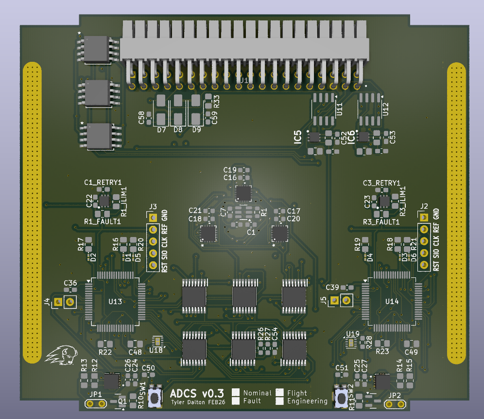
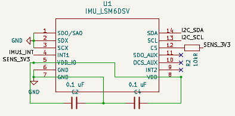
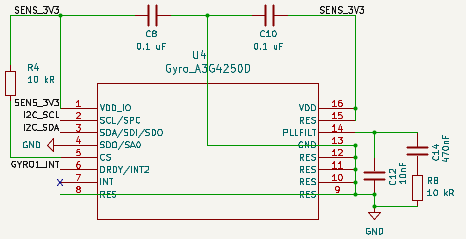
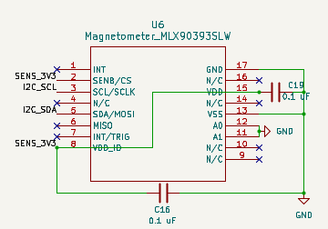
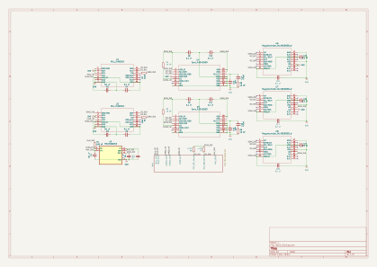
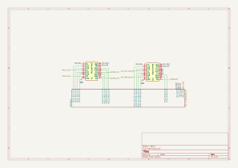

import ADCS_3D from './img/ADCS_3D.png';

# ADCS Board

{/*
import ADCS_V3Url from './img/ADCS_V3.svg?url';
import ADCS_V3 from './img/ADCS_V3.svg';

  <ADCS_V3 />
  

<ADCS_V3 />

*/}

## See Also:

- [ADCS Overview](/overview/adcs)
- [ADCS Software](/software/adcs)
- [MCU Block](/hardware/mcu)

## System Overview: 

The ADCS Board contains the attitude sensing hardware and the NDI control interface for the satellite. It includes the MCU (64-pin package, documented separately) and multiple sensors: gyroscopes, IMUs, and magnetometers. These sensors provide the data required to estimate the satellite’s orientation and angular motion.

All sensors communicate with the MCU primarily over a shared I²C bus (see block diagram), with a multiplexer used to manage devices with overlapping addresses. This allows multiple identical sensors to operate on the same system without conflict.

Multiple instances of each sensor type are included for two reasons:

    1. **Redundancy** – the system can continue operating if a sensor fails 
    2. **Noise reduction and validation** – measurements can be compared and filtered to reduce the effects of electrical noise, especially from motors and magnetorquers

## IMU “LSM6DSV”:

The IMU (Inertial Measurement Unit) combines a gyroscope and accelerometer to measure the satellite’s rotational motion and linear acceleration. This board includes two IMUs, again providing redundant measurements that improve reliability and allow for noise filtering and cross-validation of sensor data.

Voltage: 3.3v \
I2C Address 1: 0x6A \
I2C Address 2: 0x6B \
*Looking at board in Kicad* \
+X axis: down \
+Y axis: left \
+Z axis: into the board

## Gyroscope “A3G4250D”: 

ADCS is equipped with 2 rate gyros in addition to the 2 gyros included with the IMU’s. The rate gyroscopes measure the satellite’s angular velocity about each axis. This data is used directly by the control system to determine how fast the satellite is rotating and to apply corrective torques for attitude control. These sensors provide high-resolution rotational rate measurements independent of the IMUs.

Voltage: 3.3v \
Address 1: 0x68 \
Address 2: 0x69 \
*Looking at board in Kicad* \
Positive X axis: down \
Positive Y axis: left \
Positive Z axis: into page

## Magnetometer “MLX90393SLW”: 

There are 3 magnetometers on board. The magnetometer measures the magnetic field vector along three axes. This data is used to estimate the satellite’s orientation relative to Earth’s magnetic field, providing an absolute reference for attitude determination. Unlike gyroscopes, which measure rotation rate, the magnetometer provides a long-term reference that helps correct drift in the control system

Voltage: 3.3v \
Address 1: 0x0C \
Address 2: 0x0D \
Address 3: 0x0F \
*Looking at board in Kicad* \
Positive X axis: right \
Positive Y axis: up \
Positive Z axis: out of page

## What was wrong:

When we ordered the board there was mistakes with the multiplexer wiring and not having MCU1 and MCU2 constant. **That mistake was fixed in version 3.**

## Full Schematic

### ADCS Schematic

### MUX Schematic

### MCU Block Schematic

## Pin Mappings

| PIN # | PIN NAME | NAME Description |
|-------|----------|------------------|
| 1     | VBAT     |
| 2     | PC13     | LED 1
| 3     | PC14     | Cristal Oscillator
| 4     | PC15     | Cristal Oscillator
| 5     | PHO      | N/C
| 6     | PH1      | N/C
| 7     | NRST     | 
| 8     | PC0      | 
| 9     | PC1      | 
| 10    | PC2      | N/C
| 11    | PC3      | N/C
| 12    | VSSA     | 
| 13    | VDDA     | 
| 14    | PA0      | FRAM3_F
| 15    | PA1      | FRAM2_F
| 16    | PA2      | USART2_1
| 17    | PA3      | USART2_2
| 18    | VSS      | VSS
| 19    | VDD      | VDD
| 20    | PA4      | FRAM1_F
| 21    | PA5      | MCU_MR
| 22    | PA6      | VREF
| 23    | PA7      | N/C
| 24    | PC4      | N/C
| 25    | PC5      | GYRO2_INT - Tells MCU to collect data
| 26    | PB0      | AND Lock2 In
| 27    | PB1      | AND Lock1_2
| 28    | PB2      | Watch Dog
| 29    | PB10     | Chip Select
| 30    | VCAP     | VCAP
| 31    | GND      | GND
| 32    | VDD      | VDD
| 33    | PB12     | WP
| 34    | PB13     | SPI2_SCK
| 35    | PB14     | SPI2_MISO
| 36    | PB15     | SPI2_MOSI
| 37    | PC6      | GYRO1_INT - Tells MCU to collect data
| 38    | PC7      | IMU2_INT - Tells MCU to collect data
| 39    | PC8      | IMU1_INT - Tells MCU to collect data
| 40    | PC9      | SENS_EN - Enable power to all sensors by enabling switch
| 41    | PA8      | 
| 42    | PA9      | 
| 43    | PA10     | LED 2
| 44    | PA11     | 
| 45    | PA12     | 
| 46    | PA13     | 
| 47    | GND      | 
| 48    | VDDUSB   | VDDUSB
| 49    | PA14     | 
| 50    | PA15     | 
| 51    | PC10     | 
| 52    | PC11     | 
| 53    | PC12     | LED3
| 54    | PD2      | 
| 55    | PB3      | 
| 56    | PB4      | 
| 57    | PB5      | 
| 58    | PB6      | 
| 59    | PB7      | 
| 60    | PH3      | 
| 61    | PB8      | Sensor I2C (SCL)
| 62    | PB9      | Sensor I2C (SDA)
| 63    | GND      | 
| 64    | VDD      | 

*(Document written by Tyler Dalton. See original document for Contact info.)*
